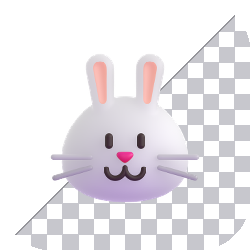
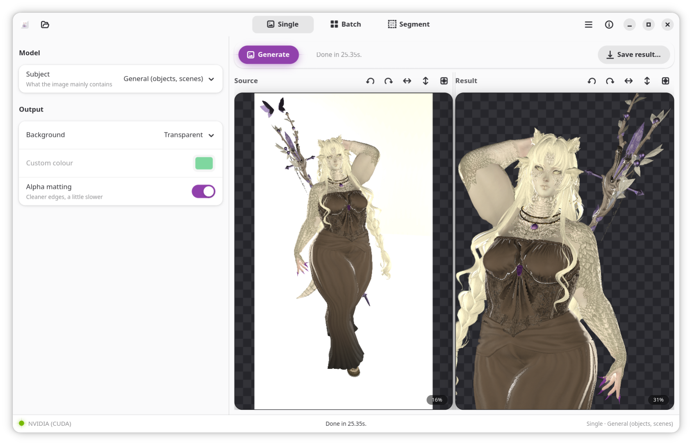
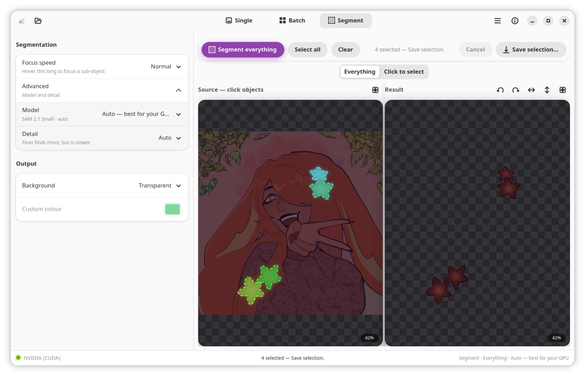

<p align="center">
  
</p>

<h1 align="center">bg-be-gone</h1>

A local image background remover *and object segmenter* with a GTK interface. It
runs [BiRefNet](https://github.com/ZhengPeng7/BiRefNet) and other
[rembg](https://github.com/danielgatis/rembg) models for **background removal**, or,
Meta's [Segment Anything](https://github.com/facebookresearch/sam2) (SAM 2.1) for **image segmentation**, through ONNX Runtime, with GPU acceleration on NVIDIA (CUDA) and AMD (ROCm), and
a CPU fallback.

Everything runs on your machine. No images are uploaded.

<table>
<tr>
<td width="50%" align="center" valign="top">

<br><b>Background removal</b>
<br><sub>Cuts the subject out of its background, one image or a whole folder, using <a href="https://github.com/ZhengPeng7/BiRefNet">BiRefNet</a>.</sub>
</td>
<td width="50%" align="center" valign="top">

<br><b>Object segmentation</b>
<br><sub>Splits the image into individual objects you pick and keep, using <a href="https://github.com/facebookresearch/sam2">SAM 2.1</a>.</sub>
</td>
</tr>
</table>

## Features

- Single-image and batch background removal.
- **Object segmentation (Segment page):** "Segment everything" turns the image
  into colour-tinted layers — click objects to keep them (the rest dim out) and
  Extract; or switch to "Click to select" to point at one object (Ctrl-click or
  right-click removes) and refine it. Runs as a separate pass from background
  removal.
- **VRAM-aware model selection:** the SAM model is chosen automatically from your
  GPU and free VRAM (SAM 2.1 large/base+/small/tiny, or MobileSAM on CPU),
  stepping down on out-of-memory or failure. Override it manually, and **Cancel**
  a slow run at any time.
- Interactive source and result panels: zoom, pan, rotate, flip, reset — per side.
- Drag and drop.
- Output: transparent, blurred background, or solid colour (white, black, green
  screen, custom).
- Subject presets (general, person, anime) plus an advanced model picker.
- Optional alpha matting for cleaner edges.
- Can be installed **segmentation-only**, without the background-removal
  dependency (see below).

## Install from source

Requirements:

- GTK 4, libadwaita, and PyGObject (system packages).
- [uv](https://docs.astral.sh/uv/) *or* Python 3.9–3.12 for the worker environment.

System packages:

| Distro | Command |
| --- | --- |
| Arch | `sudo pacman -S gtk4 libadwaita python-gobject` |
| Debian/Ubuntu | `sudo apt install gir1.2-gtk-4.0 gir1.2-adw-1 python3-gi` |
| Fedora | `sudo dnf install gtk4 libadwaita python3-gobject` |

Then:

```sh
git clone https://github.com/cristeigabriela/bg-be-gone
cd bg-be-gone
./install.sh
```

`install.sh` detects your GPU vendor, builds the worker environment, and
registers the app. Launch `bg-be-gone`, open it from your app menu, or right-click
an image and choose *Open With*. The first background removal downloads its model
(~1 GB for BiRefNet) to `~/.u2net/`; the first segmentation downloads a SAM model
(~110–770 MB depending on your GPU/VRAM) to `~/.cache/bg-be-gone/models/`.

For a lean install with **only** segmentation (no rembg/BiRefNet):

```sh
./install.sh --segment-only
```

Uninstall with `./uninstall.sh` (add `--purge` to also remove the environment).

## AppImage

Each [release](../../releases) attaches three AppImages — pick one for your
hardware, `chmod +x`, and run:

| File | Use |
| --- | --- |
| `bg-be-gone-<ver>-cpu-x86_64.AppImage` | Any machine (CPU only). |
| `bg-be-gone-<ver>-cuda-x86_64.AppImage` | NVIDIA GPU (recent driver); CPU fallback. |
| `bg-be-gone-<ver>-rocm-x86_64.AppImage` | AMD GPU with ROCm; CPU fallback. |
| `bg-be-gone-<ver>-seg-x86_64.AppImage` | Lean, segmentation-only (no background removal). |

The GPU builds are larger. If unsure, use the CPU build or install from source.

## Usage

- **Single:** open or drop an image, choose settings, click **Generate**, then
  **Save result**. Right-click either panel (or use the toolbar icons) to rotate,
  flip, reset the view, or zoom to actual size. Scroll to zoom, drag to pan.
- **Batch:** choose an input folder and an output folder, set a rename pattern
  (`{name}` = original filename, `{n}` = index), and click **Run batch**. Output
  is PNG.
- **Segment:** open an image and pick a **Mode** in the sidebar. In *Everything*,
  click **Segment everything** to detect objects as tinted layers, click the ones
  to keep (the rest dim), then **Extract selection**. In *Click to select*, click
  an object to select it (Ctrl-click or right-click to subtract), then **Extract**.
  The chosen SAM model and device are shown in the sidebar; **Cancel** stops a
  slow run. Extract uses the same background options as background removal.

## GPU support

The worker picks the first available ONNX Runtime provider: CUDA (NVIDIA),
ROCm/MIGraphX (AMD), then CPU. The active device is shown in the sidebar.

- NVIDIA: `install.sh` installs `onnxruntime-gpu` and the required CUDA runtime.
- AMD: `install.sh` installs the CPU runtime and attempts `onnxruntime-rocm`. For
  ROCm acceleration you may need to install a wheel matching your ROCm version.

## Credits

- Background removal by [rembg](https://github.com/danielgatis/rembg) and
  [BiRefNet](https://github.com/ZhengPeng7/BiRefNet).
- Object segmentation by Meta's [Segment Anything / SAM 2.1](https://github.com/facebookresearch/sam2)
  and [MobileSAM](https://github.com/ChaoningZhang/MobileSAM) (Apache-2.0), via
  ONNX exports. See [NOTICE](NOTICE) for model attribution.
- App icon uses the rabbit from
  [Fluent Emoji](https://github.com/microsoft/fluentui-emoji) (MIT).

## License

[MIT](LICENSE)
