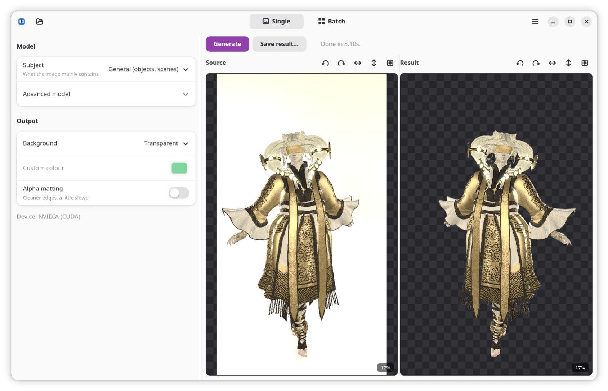

# bg-be-gone

A local image background remover with a GTK interface. It runs
[BiRefNet](https://github.com/ZhengPeng7/BiRefNet) and other
[rembg](https://github.com/danielgatis/rembg) models through ONNX Runtime, with
GPU acceleration on NVIDIA (CUDA) and AMD (ROCm), and a CPU fallback.

Everything runs on your machine. No images are uploaded.



## Features

- Single-image and batch modes.
- Interactive source and result panels: zoom, pan, rotate, flip, reset — per side.
- Rotate/flip are applied to the exported image; zoom/pan are view-only.
- Drag and drop.
- Output: transparent, blurred background, or solid colour (white, black, green
  screen, custom).
- Subject presets (general, person, anime) plus an advanced model picker.
- Optional alpha matting for cleaner edges.

## Install from source

Requirements:

- GTK 4, libadwaita, and PyGObject (system packages).
- [uv](https://docs.astral.sh/uv/) *or* Python 3.9–3.12 for the worker environment.

System packages:

| Distro | Command |
| --- | --- |
| Arch | `sudo pacman -S gtk4 libadwaita python-gobject` |
| Debian/Ubuntu | `sudo apt install gir1.2-gtk-4.0 gir1.2-adw-1 python3-gi` |
| Fedora | `sudo dnf install gtk4 libadwaita python3-gobject` |

Then:

```sh
git clone https://github.com/cristeigabriela/bg-be-gone
cd bg-be-gone
./install.sh
```

`install.sh` detects your GPU vendor, builds the worker environment, and
registers the app. Launch `bg-be-gone`, open it from your app menu, or right-click
an image and choose *Open With*. The first run downloads the selected model
(~1 GB for BiRefNet) to `~/.u2net/`.

Uninstall with `./uninstall.sh` (add `--purge` to also remove the environment).

## AppImage

Each [release](../../releases) attaches three AppImages — pick one for your
hardware, `chmod +x`, and run:

| File | Use |
| --- | --- |
| `bg-be-gone-<ver>-cpu-x86_64.AppImage` | Any machine (CPU only). |
| `bg-be-gone-<ver>-cuda-x86_64.AppImage` | NVIDIA GPU (recent driver); CPU fallback. |
| `bg-be-gone-<ver>-rocm-x86_64.AppImage` | AMD GPU with ROCm; CPU fallback. |

The GPU builds are larger. If unsure, use the CPU build or install from source.

## Usage

- **Single:** open or drop an image, choose settings, click **Generate**, then
  **Save result**. Right-click either panel (or use the toolbar icons) to rotate,
  flip, reset the view, or zoom to actual size. Scroll to zoom, drag to pan.
- **Batch:** choose an input folder and an output folder, set a rename pattern
  (`{name}` = original filename, `{n}` = index), and click **Run batch**. Output
  is PNG.

## GPU support

The worker picks the first available ONNX Runtime provider: CUDA (NVIDIA),
ROCm/MIGraphX (AMD), then CPU. The active device is shown in the sidebar.

- NVIDIA: `install.sh` installs `onnxruntime-gpu` and the required CUDA runtime.
- AMD: `install.sh` installs the CPU runtime and attempts `onnxruntime-rocm`. For
  ROCm acceleration you may need to install a wheel matching your ROCm version.

## Layout

```
src/bgbg/app.py      GTK/libadwaita frontend (system Python)
src/bgbg/viewer.py   interactive image view (zoom/pan/rotate/flip)
src/bgbg/worker.py   background-removal worker (bundled venv)
bin/bg-be-gone        launcher
data/                 desktop entry, icon, AppStream metadata
packaging/            AppImage build
install.sh            per-user install
```

The frontend and worker communicate over line-delimited JSON. The worker keeps
the model resident on the GPU between requests.

## Credits

- Background removal by [rembg](https://github.com/danielgatis/rembg) and
  [BiRefNet](https://github.com/ZhengPeng7/BiRefNet).
- App icon uses the rabbit from
  [Fluent Emoji](https://github.com/microsoft/fluentui-emoji) (MIT).

## License

MIT. See [LICENSE](LICENSE).
